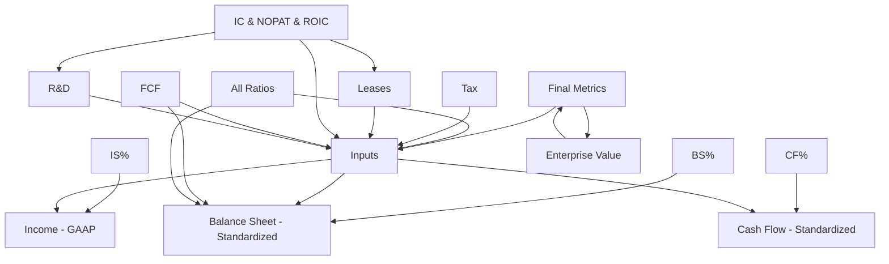

# Industrial Template — Dependency Map (M1)

Derived from cross-sheet formula references in the AAPL Industrial Template v27.6 (validated that sheet inventory is shared across the suite). Edge weights are counts of formulas on the **From** sheet that reference the **To** sheet (best-effort parse).

## High-level mermaid graph (edges with ≥20 refs)

## Full edge list (AAPL, top 80)

| From | To | Refs |
|------|----|------|
| `BS%` | `Balance Sheet - Standardized` | 1110 |
| `IS%` | `Income - GAAP` | 542 |
| `CF%` | `Cash Flow - Standardized` | 530 |
| `Inputs` | `Balance Sheet - Standardized` | 371 |
| `Final Metrics` | `Inputs` | 243 |
| `All Ratios` | `Inputs` | 177 |
| `Inputs` | `Income - GAAP` | 173 |
| `Tax` | `Inputs` | 150 |
| `Leases` | `Inputs` | 90 |
| `IC & NOPAT & ROIC ` | `Inputs` | 70 |
| `FCF` | `Inputs` | 50 |
| `Enterprise Value` | `Final Metrics` | 47 |
| `Inputs` | `Cash Flow - Standardized` | 40 |
| `IC & NOPAT & ROIC ` | `Leases` | 30 |
| `IC & NOPAT & ROIC ` | `R&D` | 30 |
| `R&D` | `Inputs` | 23 |
| `Final Metrics` | `Enterprise Value` | 23 |
| `FCF` | `Balance Sheet - Standardized` | 20 |
| `All Ratios` | `Balance Sheet - Standardized` | 20 |
| `Expected Returns & Buybacks` | `Final Metrics` | 16 |
| `Final Metrics` | `Income - GAAP` | 11 |
| `FCF` | `Tax` | 10 |
| `FCF` | `Income - GAAP` | 10 |
| `IC & NOPAT & ROIC ` | `Tax` | 10 |
| `Tax` | `IC & NOPAT & ROIC ` | 10 |
| `Leases` | `Income - GAAP` | 10 |
| `Leases` | `Balance Sheet - Standardized` | 10 |
| `All Ratios` | `FCF` | 10 |
| `Final Metrics` | `IC & NOPAT & ROIC ` | 10 |
| `Final Metrics` | `Balance Sheet - Standardized` | 10 |
| `Final Metrics` | `FCF` | 10 |
| `Expected Returns & Buybacks` | `Income - GAAP` | 8 |
| `Last Quarter BS Standardized` | `Inputs` | 7 |
| `Enterprise Value` | `Last Quarter BS Standardized` | 6 |
| `Last Quarter BS Standardized` | `Last Quarter IS Standardized` | 3 |
| `Expected Returns & Buybacks` | `Balance Sheet - Standardized` | 3 |
| `Expected Returns & Buybacks` | `Inputs` | 2 |
| `IS%` | `Balance Sheet - Standardized` | 1 |
| `CF%` | `Balance Sheet - Standardized` | 1 |
| `Last Quarter BS Standardized` | `Income - GAAP` | 1 |
| `Last Quarter BS Standardized` | `Balance Sheet - Standardized` | 1 |
| `Final Metrics` | `Cash Flow - Standardized` | 1 |
| `Final Metrics` | `Last Quarter CF Standardized` | 1 |
| `Final Metrics` | `Last Quarter IS Standardized` | 1 |
| `Final Metrics` | `Last Quarter BS Standardized` | 1 |
| `Final Metrics` | `All Ratios` | 1 |

## Per-ticker edge-pair comparison

### MSFT vs AAPL
- Shared edge types: 46
- Only in AAPL (sample): —
- Only in MSFT (sample): —

### AMZN vs AAPL
- Shared edge types: 46
- Only in AAPL (sample): —
- Only in AMZN (sample): —

### TJX vs AAPL
- Shared edge types: 46
- Only in AAPL (sample): —
- Only in TJX (sample): —

## Interpretation note

Percentage and LQ sheets often pull from their standardized siblings. `Inputs` / `All Ratios` / `Final Metrics` / valuation sheets sit downstream. M1.5 will assign write policies so HAP never writes into pure formula sinks.
